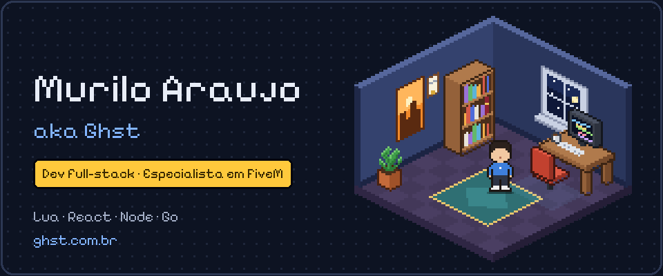

<picture>
  <source media="(prefers-color-scheme: dark)" srcset="assets/banner-night.gif" />
  <source media="(prefers-color-scheme: light)" srcset="assets/banner-day.gif" />
  
</picture>

  
  
  
  

  

### 👾 Quem é o Ghst

Sou Murilo Araujo, mas na comunidade todo mundo me chama de Ghst. Comecei a programar em 2019 escrevendo scripts em Lua para servidores de roleplay no FiveM e nunca mais parei. Hoje trabalho como full-stack: penso o sistema, construo a interface, escrevo a API e cuido de onde tudo isso roda.

E sim, sou bacharel em Direito. Troquei o Vade Mecum pelo VS Code e não me arrependo: o Direito não virou profissão, mas me deixou um olhar mais aguçado para a vida.

**Missões**

1. Fazer o bem
2. Ser a diferença
3. Trazer soluções

### 🗺️ Trajetória

`Lv.1` **Primeiro spawn** · Freelance · _2019 — atual_\
Scripts em Lua que viraram trabalho: freelas e consultorias criando sistemas, interfaces e integrações em produção.

`Lv.2` **Das NUIs para a web** · Evolução\
As interfaces dentro do jogo me levaram ao React e ao TypeScript; depois vieram Node.js, NestJS, bancos de dados e Docker.

`Lv.3` **Loja própria** · Ghst.store · 🚩 _desativada temporariamente_\
Plataforma de venda de scripts FiveM com licenças automáticas, painel do cliente e integração com Discord.

`Lv.4` **Liderança técnica** · LesteGroup · _Ago 2025 — Dez 2025_\
Tech Lead do grupo da Fronteira Leste e desenvolvedor integral do Lado Leste.

`Lv.5` **Missão atual** ⭐ · WinsVue · _Dez 2025 — atual_\
Sistemas, interfaces, integrações e sustentação de todos os servidores do portfólio da WinsVue.

### 🎒 Inventário

Também: Fastify · ClickHouse

### 📦 Projeto aberto

**[portfolio](https://github.com/anthony-amla/portfolio)**: o meu site, [ghst.com.br](https://ghst.com.br). Um quarto isométrico em pixel art desenhado em canvas, trilha chiptune gerada no navegador, português e inglês, e deploy no Cloudflare Pages. React, Vite e uma função serverless para o formulário de contato.

O resto do que eu construo é para clientes e empresas, então fica em repositórios privados.

Cada pixel feito com carinho · <a href="https://ghst.com.br">ghst.com.br</a>

